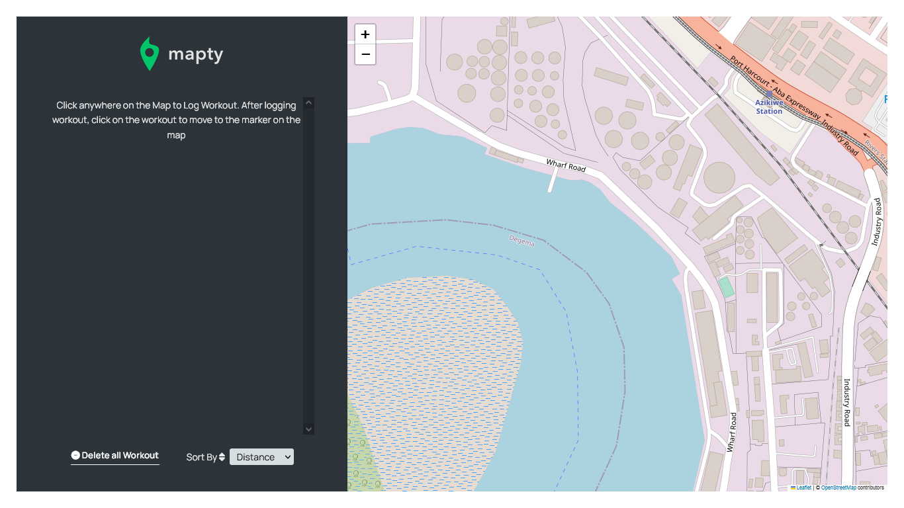

# MAPTI - A Fitness App

Welcome to **MAPTI**, the fitness companion 💪🏾. Mapti is designed too allow users to log their fitness data either running or cycling data to keep track of their progress. It takes in the Distance, Duration, Cadence and Elevation Gain of the workout. It makes use of a couple of API's to get users location and weather data.

